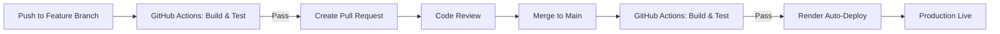

# CI/CD Documentation

## 📋 Overview

Project này sử dụng **GitHub Actions** + **Render Auto-Deploy** cho CI/CD pipeline.

### Flow
```
Developer Push Code → GitHub Actions (Build & Test) → Merge to Main → Render Auto-Deploy
```

## 🔧 GitHub Actions Workflow

### Workflow: [CI - Build and Test](file:///.github/workflows/ci.yml)

**Triggers:**
- Push to `main`, `master`, hoặc `develop` branches
- Pull Requests to `main` hoặc `master`

**Steps:**
1. ✅ Checkout code
2. ✅ Setup .NET 8.0
3. ✅ Restore NuGet packages
4. ✅ Build solution (Release mode)
5. ✅ Run tests (nếu có)
6. ✅ Generate build summary

**Benefits:**
- Catch build errors sớm
- Prevent broken code từ merge vào main
- Fast feedback (5-10 phút)
- Dependency caching

## 🚀 Render Auto-Deploy Setup

### Prerequisites

1. **GitHub Repository**: Code phải push lên GitHub
2. **Render Account**: Đã có service trên Render

### Enable Auto-Deploy on Render

1. Vào **Render Dashboard** → Chọn service của bạn
2. Vào **Settings** tab
3. Tìm **Build & Deploy** section
4. Bật **Auto-Deploy**: `Yes`
5. Chọn **Branch**: `main` (hoặc branch bạn muốn deploy)

✅ Done! Render sẽ tự động deploy khi có code mới merge vào `main`.

### Deploy Flow



## 📊 Monitoring & Logs

### GitHub Actions

1. Vào repository → **Actions** tab
2. Xem workflow runs
3. Click vào run để xem detailed logs
4. Mỗi step có logs riêng

### Render Deployment

1. Vào **Render Dashboard**
2. Chọn service → **Logs** tab
3. Xem real-time deployment logs
4. Check **Events** tab để xem deployment history

## 🔒 Branch Protection (Optional)

Để bảo vệ `main` branch, enable branch protection rules:

1. Vào **GitHub Repository** → Settings → Branches
2. Add rule cho `main` branch
3. Enable:
   - ✅ Require pull request reviews before merging
   - ✅ Require status checks to pass before merging
     - Select: `Build and Test` workflow
   - ✅ Require branches to be up to date before merging

## 🐛 Troubleshooting

### GitHub Actions Failed

**Problem**: Workflow fails on build
- Check error logs trong Actions tab
- Verify dependencies trong .csproj files
- Chạy `dotnet build` locally để reproduce lỗi

**Problem**: Workflow không trigger
- Verify workflow file syntax (.yml format)
- Check branch name trong trigger config
- Ensure workflow file trong `.github/workflows/` folder

### Render Deploy Failed

**Problem**: Render không auto-deploy
- Verify Auto-Deploy enabled trong Render settings
- Check correct branch được select
- Xem Render event logs để xem lỗi

**Problem**: Deploy timeout
- Kiểm tra build command trong Render settings
- Verify start command đúng
- Check resource limits (RAM/CPU)

**Problem**: Database connection failed
- Verify connection string environment variables
- Check Azure SQL firewall rules
- Ensure Render IP được whitelist

## 📝 Environment Variables

### Render Environment Variables

Đảm bảo các environment variables sau được set trong Render:

- `ASPNETCORE_ENVIRONMENT`: Production
- `ConnectionStrings__DefaultConnection`: Azure SQL connection string
- `Jwt__Key`: JWT secret key
- `Jwt__Issuer`: JWT issuer
- `Jwt__Audience`: JWT audience
- `Mqtt__*`: MQTT configuration (nếu cần)

## 🎯 Best Practices

1. **Always create feature branches**: Không push trực tiếp vào `main`
2. **Write meaningful commit messages**: Để dễ tracking changes
3. **Test locally trước**: `dotnet build` và `dotnet test`
4. **Review PR carefully**: Check code và GitHub Actions status
5. **Monitor deployment**: Xem Render logs sau khi deploy
6. **Rollback nếu cần**: Render → Deployments → Redeploy previous version

## 🆘 Quick Commands

```bash
# Test build locally
cd d:\Ki_7\SWD\SWD\SWD_PROJECT
dotnet restore
dotnet build --configuration Release

# Create feature branch
git checkout -b feature/your-feature-name

# Push and create PR
git add .
git commit -m "Your descriptive message"
git push origin feature/your-feature-name

# Update from main
git checkout main
git pull origin main
git checkout feature/your-feature-name
git merge main
```

## 📚 Resources

- [GitHub Actions Documentation](https://docs.github.com/en/actions)
- [Render Documentation](https://render.com/docs)
- [.NET CLI Reference](https://learn.microsoft.com/en-us/dotnet/core/tools/)
